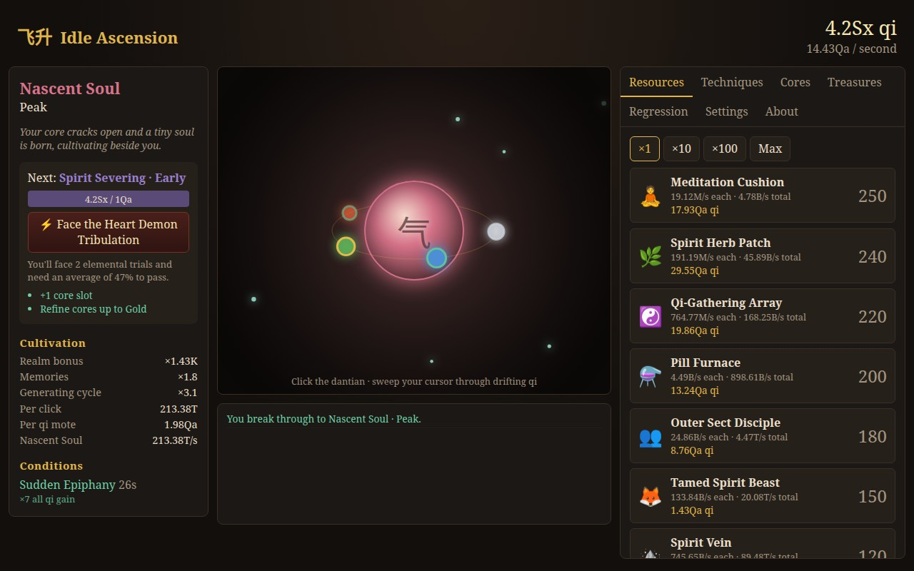

# Idle Ascension 飞升

**[Play it at idle-ascension.brendanlong.com](https://idle-ascension.brendanlong.com/)**

By [Brendan Long](https://www.brendanlong.com/pages/about-me.html)

A cookie-clicker-style idle game steeped in wuxia / xianxia cultivation tropes. You start as the
"trash" of the Lin clan and cultivate your way from Mortal to Godhood.



It runs in the browser on desktop or phone, and can be added to your home screen to play offline.

## Playing

- **Gather**: sweep your cursor (or finger) through drifting qi motes to absorb them, or press the dantian orb to draw in the nearest one. Gathering roughly doubles or triples what you'd earn idle; from Nascent Soul on, your soul gathers some motes for you.
- **Resources**: meditation cushions, spirit herbs, pill furnaces, disciples, spirit veins, secret realms, all the way up to shards of primordial chaos. Each produces qi per second.
- **Techniques**: one-off upgrades (palm techniques, scriptures, and ×2 upgrades for each resource at ownership milestones), with a Buy All button.
- **Breakthroughs**: spend qi to advance through realms — Qi Condensation (9 layers), Foundation Establishment, Core Formation, Nascent Soul, Spirit Severing, Dao Seeking, Immortal Ascension, Godhood. Each stage multiplies all qi gain.
- **Elemental trials**: short mouse mini-games, one per element: click the flame seals, sweep through a flowing current, chase a wood spirit, trace an earth formation, dodge a rain of blades. From Foundation Establishment, optional trials appear now and then for rewards that scale with your score.
- **Heavenly Tribulations**: major breakthroughs from Core Formation onward are a series of elemental trials (1–3, more in later realms). Average below the pass mark and the breakthrough fails and you're injured. Leniency lowers the pass mark; slowdown slows the trials. Settings → Trial assistance makes trials easier and slower, or skips them.
- **Cores**: from Core Formation you condense cores. Each is attuned to one of the Five Elements (its colour/effect) and refined through metal grades (Mud → Iron → Bronze → … → Primordial). Your realm limits how far you can refine. Cores adjacent in the generating cycle (Wood → Fire → Earth → Metal → Water → Wood) grant a bonus.
- **Fortuitous encounters**: arrogant young masters, hidden caves, mysterious old beggars… click them for qi windfalls, buffs, or treasures.
- **Treasures**: rarer finds from encounters, each with a permanent bonus. Finding a treasure again refines it to a higher level.
- **Regression (prestige)**: once you've reached Core Formation, court death and let your mother's jade pendant send you back to age sixteen. You keep **Memories** (each multiplies qi by ×1.02, forever; deeper regressions yield more, and they settle over the first 10 minutes of each life) and spend them on permanent insights, most of which can be levelled up indefinitely. Stages you've reached before cost a fraction as much, with no tribulation or requirement, so you're soon back where you left off.
- **Closed-door cultivation**: offline progress (capped, reduced efficiency; both upgradeable). Leaving the tab in the background for over a minute counts too.

## Development

```bash
npm install
npm run dev        # Vite dev server
npm test           # Vitest unit tests for the engine
npm run typecheck
npm run build
npm run sim -- 72 10     # headless balance sim: max hours, minutes without progress before regressing
SIM_PLAYER=passive npm run sim   # also active, or taper (default); see scripts/sim.ts for SIM_TREASURES, SIM_IMPACT, SIM_TUNE
scripts/balance/eval.sh <(echo '{}') SIM_PLAYER=passive   # 6 seeds; see scripts/balance/ for the price tuner
npm run format
npm run social-preview   # re-render public/social-preview.jpg from scripts/social-preview.html
npm run icons            # re-render the favicon and install icons in public/
npm run screenshot       # re-take docs/screenshot.jpg for this README
```

The last three need a Playwright browser the first time: `npx playwright install chromium`.

### Deployment

The game is a static site: saves live in the browser's `localStorage`. Every push to `main` runs
`.github/workflows/deploy.yml`, which tests, builds and publishes `dist/` to GitHub Pages
(Settings → Pages → Source: GitHub Actions) at the custom domain above. The About tab shows the commit
each build came from.

A service worker (`vite-plugin-pwa`) caches the whole game, so it works offline and can be installed.
A new version downloads in the background and takes effect on the next reload.

Because saves are tied to the site's origin, changing the domain later starts players over (they can
carry progress across with Settings → Export/Import).

### Layout

```
src/
  content/   Pure data: realms, generators, upgrades, cores & elements, treasures, buffs,
             encounters, perks, lore text. Most new content is a new entry in one of these files.
  engine/    Pure game logic, no DOM. Mutates a single serializable GameState.
    effects.ts     Every bonus is an Effect that folds into one Modifiers object.
    stats.ts       computeStats(): all derived numbers (qi/s, mote value, …) in one place.
    economy.ts     Qi, generators, upgrades, buffs, treasures.
    breakthrough.ts  Realm progression and tribulations.
    trials.ts      Optional trial offers and rewards.
    cores.ts, encounters.ts, prestige.ts, conditions.ts
    text.ts        Randomized encounter and story text.
    tick.ts        Time: live ticks and offline progress.
    save.ts        (De)serialization with versioned migrations and default-filling.
  ui/        Preact components. game.ts owns the state, runs the clock, and autosaves.
             Below 760px wide, App.tsx switches to a tabbed phone layout.
    trials/  The elemental trial mini-games (DOM-free, tested by scripting a player) and their overlay.
scripts/     The balance sim (a greedy bot) and the image generators.
```

### Adding things

- **New bonus type**: add a field to `Modifiers` in `engine/effects.ts` (plus its label), then read it in `stats.ts` or wherever it applies. Realms, upgrades, treasures, perks, cores and buffs can all grant it immediately.
- **New upgrade / treasure / encounter / perk**: add an entry to the relevant `content/` file. `content.test.ts` checks ids and cross-references.
- **Changing the save shape**: players' saves must keep loading. New fields in `GameState` (including nested objects) are filled from `createInitialState()` on load, and `sanitize()` drops references to content that no longer exists. Anything else (fields in array items or nullable objects, renames, changed meanings) needs `SAVE_VERSION` bumped, a migration in `engine/save.ts`, and a new frozen save in `engine/__tests__/fixtures/`. The fixture test loads every old save and fails if the current version has none.
- **Rebalancing**: run `npm run sim` before and after.

## Design notes

**Why regression (time loop) for prestige?** It's the only one of the three options that explains _why_ you keep anything: you remember. That makes the prestige currency (Memories) and the perks ("you know which cliffs to fall off", "you've died to this lightning before") write themselves, and it matches the popular regressor genre. The other two ideas still fit as later layers:

- **Reincarnation** could be a second, deeper prestige layer: you lose your Memories but keep something more fundamental (your soul's element affinity or spiritual root quality).
- **Isekai** is the endgame: after reaching Godhood, you get hit by a truck and start over in a new world with different rules. That's effectively "New Game+", and the victory screen already hints at it.

### Ideas not yet implemented

- Spiritual roots chosen or rolled at the start of each loop (single-element "heavenly root" vs. mixed "trash root") that modify element bonuses.
- Heart demons: a negative event during Spirit Severing that you have to resolve.
- Sect management as a minigame (disciples go on missions).
- Alchemy crafting with herbs → pills as a second resource.
- Swapping JS numbers for `break_eternity.js` if the numbers need to go past ~1e308.
